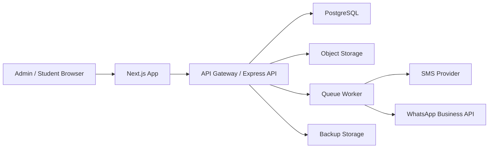

# Architecture

## Product Scope

ExamDesk Library OS manages competitive exam reading rooms where students book desks or seats for fixed shifts and long study plans. The system supports:

- Owner dashboard for students, seats, shifts, fees, attendance, reports, reminders, staff, and backups
- Student portal for profile, attendance, fee status, and receipts
- Secure role separation between Super Admin, Staff, and Student
- QR-style attendance, drag-and-drop seat assignment, and smart student search

## Current Runnable Stack

This starter is package-free so it can run immediately in restricted environments:

- Frontend: HTML, CSS, JavaScript SPA
- Backend: Node.js built-in HTTP server
- Storage: JSON data file at `data/library-data.json`
- Auth: PBKDF2 password hashes and signed JWT-style access tokens

The current stack is ideal for demoing, validating workflows, and giving the future production build a precise blueprint.

## Production Stack

Recommended production implementation:

- Frontend: Next.js, React, Tailwind CSS, shadcn/ui, TanStack Table, Recharts
- Backend: Node.js with Express or NestJS
- Database: PostgreSQL
- ORM: Prisma
- Auth: JWT access tokens with refresh tokens, Clerk, or Firebase Auth
- File storage: AWS S3 or Cloudinary for photos and receipts
- Notifications: WhatsApp Business API plus SMS provider
- Jobs: BullMQ or cloud scheduler for due alerts, expiry reminders, and backups
- Observability: structured logs, request tracing, and uptime monitoring

## Domain Modules

### Identity & Security

- Users store role, status, hashed password, and optional linked student ID.
- Owner-only actions include delete student, financial exports, staff creation, and backups.
- Staff can handle daily operations but should not access financial exports.
- Students can only access their own profile, attendance, and receipts.

### Student Profiles

Student profiles include personal details, photo, parent/contact information, seat, shift, study hours, joining date, expiry date, fee status, payment history, and attendance logs.

### Seat & Shift Management

Seats are physical resources. A seat can be reused across different non-overlapping shifts, but the same seat cannot be assigned twice within the same shift. Reserved seats are owner-controlled and blocked by the API.

### Attendance

Attendance supports QR check-in and check-out. Production should use signed QR payloads with short expiry windows and device/IP audit logging.

### Billing

Payments support UPI, Cash, Card, and Bank transfer. Each payment generates a receipt number. Production should add immutable ledger entries and optionally invoice numbering by branch.

### Notifications

The current app queues reminders. Production should hand queued reminders to SMS and WhatsApp providers through a background worker with retries, rate limits, and delivery status.

## Deployment Shape

## Security Baseline

- Enforce HTTPS everywhere
- Store passwords with Argon2id or bcrypt in production
- Use short-lived access tokens and refresh token rotation
- Add CSRF protection if cookies are used
- Validate every input with a schema validator
- Add audit logs for financial, identity, and student record changes
- Encrypt backups at rest
- Restrict exports to Super Admin
- Apply row-level checks so students can read only their own records

